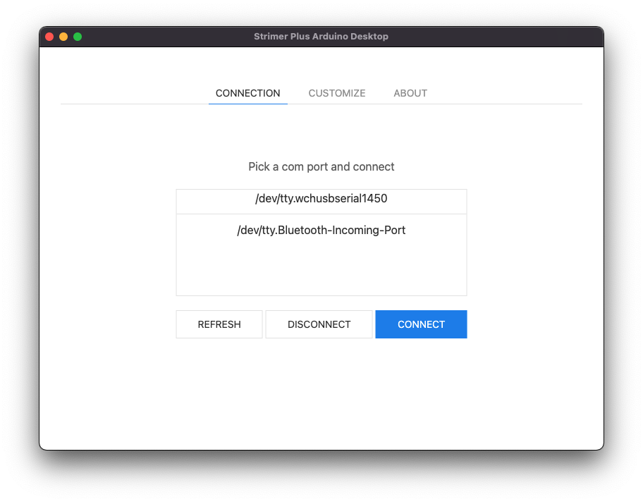
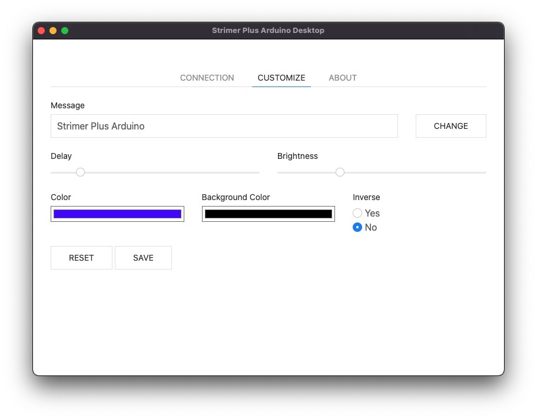

# Strimer Plus Arduino Desktop

It's a GUI tool to using on desktop device like Windows or MacOS X. Help you to manage for [Strimer Plus Arduino](https://github.com/themt/Strimer_Plus_Arduino) You can change scrolling text message, color or whatever with this tool. It can run Windows and MacOS X.

 

## Electron JS Based

I develop this GUI tool with [ElectronJS](https://www.electronjs.org) and it's open source.

## What Is Strimer Plus

[Strimer Plus](https://lian-li.com/product/strimer-2-24pin/) is a product for PC cases for gaming pc.

> Addressable RGB extension cables. Multi-connector support MB 24PIN, GPU 8 PIN. Unparalleled RGB effects. Brighter and more complex light effects, premium build quality with a clean look, vibrant and smooth lighting quality. Work better, last longer.

## Why Strimer Plus Arduino

Because original product not customizable and it's not cool enought. Strimer Plus Arduino can you show scrolling text, color, speed and backgroud color are changable.

## License

About License you can look up LICENSE.txt
